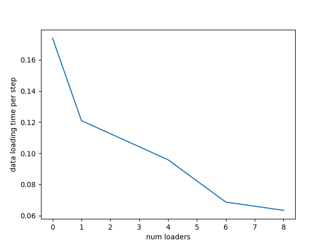
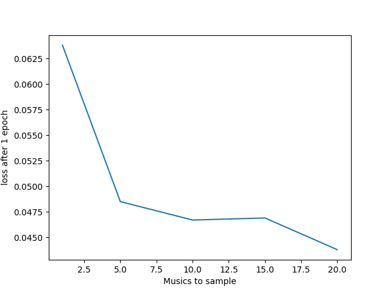
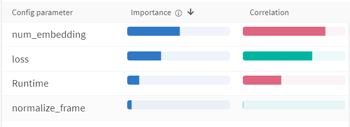
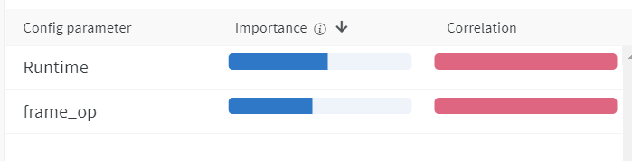
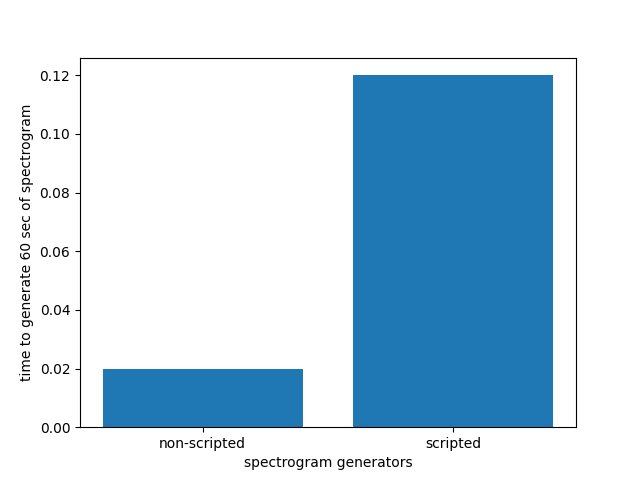
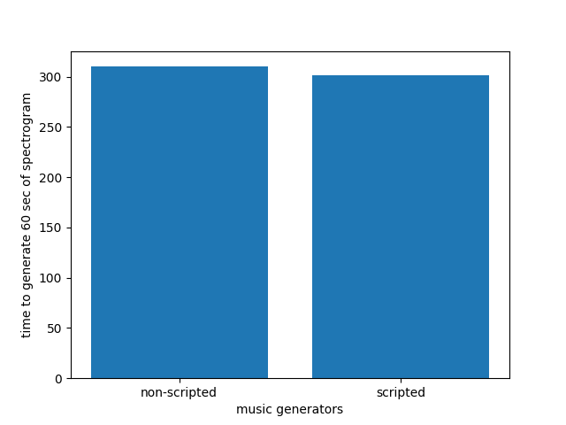

# Spectrogram-based Music Generator
This is the code for the project spectrogram-based music generator.  
The music generating model has 2 parts: VQ-VAE and token genrator. During training time, the VQ-VAE encoder and decoder are trained to first encode the spectrogram into a sequence of tokens then reconstruct the input spectrogram from the latent representation.  
After the VQ-VAE is trained, it can then generate the tokens for training the token generator.  
After both models are trained, the spectrogram generator can generate new musics from the tokens from the token generator.  

## Outline
### data.py
Contains several classes and callables, that I use to load the data for training the model.  
  * data.worker_init_fn: split the dataset among workers for dataloader.
  * data.move_data: move data to cuda.
  * data.Music_dataset_iter: an iterable dataset for loading music files then convert them to spectrograms. Used for training the spectrogram generator.
  * data.Token_dataset_iter: an iterable dataset for loading tokens. Used for training token generator. Note, this dataset will not work unless the tokens has been generated.
  * data.collate_token: batch collator for token generator.
  * data.Batch_collator: batch collator for spectrogram generator. 
### download_data.py
A script used for downloading the dataset.  

### generate_music.py
A script used for generating musics with trained models.

### generate_tokens.py
A script used for generating tokens for training the token generator.

### hyperparameters.py
Contains a set of hyperparameters.

### model.py
Contains the models:
  * models.Spectrogram_generator: the spectrogram generator consisting of an encoder and a decoder.
  * models.Token_generator: the token generator model.

### module.py
Contains some custom pytorch modules.
  * module.Positional_embedding: since tokens do not have positional information, this module is used in the spectorgram decoder and the token generator.
  * module.Gaussian_noise: adds some gaussian noise to the input. Used for regularization.
  * module.Residual_block: Passes the input through 2 linear layers then adds the result with the input.
  * module.Attention_block: mimics the attention block in the paper "Attention is all you need". Consists of one attention layer and two linear layers. 
  * module.Loss_func: custom designed loss function.
  * module.Time_distributed: invoke the module along some time axis.
### process_audio.py
Some helper functions for dealing with wave forms and spectrograms. 
### train_spectrogram_generator.py
Script for training the spectrogram generator
### train_token_generator.py
Script for training the token generator
### utils.py
Some helper functions

## Running The Code
### Collecting data
Data should be under the folder ./data/  
Somehow pytube no longer works on my computer, please download the portion of data I uploaded: https://drive.google.com/file/d/1UZlr7ryyfiC2nLx5D7M0ZjyLPJsT7D0w/view?usp=sharing which has 200 mp3 files. If you are using audio from other sources, please ensure there are at least 200 mp3 files, preferably all with a sample rate of 44100.  
If you still want to try the data downloading program, please install the latest version of pytube then run download_data.py.

### Training spectrogram generator
Simply run train_frame_enc.py, the experiment results will be saved under experiments/frame_emcoder/  

### Training token generator  
Before training token generator, please generate the tokens for all musics using generate_tokens.py. Note the tokens should be generated by a fully trained spectrogram generator, otherwise they will not be useful for generating musics.

## Generating music  
After all the models are trained, run generate_music.py to generate musics from the trained model.  
The script will generate 2 audio files under generated_music/:  
scripted_frame_encoder.wav, this is the reconstructed audio input by the auto encoder.  
scripted_music_generator.wav, this is the generated new music.

# Experiment results
## Data loading

  
While loading the data using more loader shows a decreased average data loading time, the number of loader is limited due to the result of figure 2.
  
Figure 2 shows the number of musics the data loader should load and sample from before returning any datapoint. The more musics it loads, the closer the batch distribution is to the population disribution, thus loss will be lower.   

## Hyper parameter importance

  
This experiment shows the hyperparameters and their importance. As shown in the figure, the loss is highly negatively correlated to the number of embeddings used by the spectrogram generator. Figure 2 shows using attention layer and letting the generator to condition on previous tokens also deccreases the loss significantly.  

However, using a combination of L1 and L2 loss as loss function increases the final loss (measured by L2 loss), normalizing the spectrogram does not change the loss significantly.  

## Torch script speed up

  
The first figure shows scripting the spectrogram generator will result in some but not significant slow down, but scripting the music generator (token generator + spectrogram generator) will result in some speed up.

## Wandb Logs:
hyperparam sweep 1: https://wandb.ai/junzhangliu/music_gen_linear_sweep?workspace=user-ayhexinf  
hyperparam sweep 2: https://wandb.ai/junzhangliu/music_gen_frame_op?workspace=user-ayhexinf  

